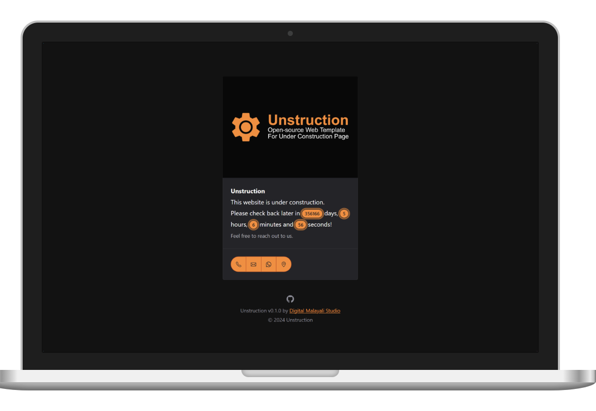

<div align="center">

# Unstruction

[](https://jekyllrb.com)
[](https://rubygems.org/gems/unstruction-jekyll-theme)
[](https://rubygems.org/gems/unstruction-jekyll-theme)

[](https://github.com/digitalmalayalistudio/unstruction)
[](https://github.com/DigitalMalayaliStudio/unstruction-wordpress-theme)

[](https://liberapay.com/zcraber)

A minimal, lightweight, easy and free Jekyll theme to create a 'website under construction' page.

[](https://digitalmalayalistudio.github.io/unstruction-jekyll-theme/)

[**Live Demo ◉**](https://digitalmalayalistudio.github.io/unstruction-jekyll-theme/)

</div>

## Contents
- [Unstruction](#unstruction)
  - [Contents](#contents)
  - [Features](#features)
  - [Installation](#installation)
    - [Use GitHub Template (Easiest Way)](#use-github-template-easiest-way)
    - [Install as GitHub Remote Theme](#install-as-github-remote-theme)
    - [Install as Ruby Gem](#install-as-ruby-gem)
  - [Configuration](#configuration)
    - [`_config.yml`](#_configyml)
  - [Contributing](#contributing)
  - [Development](#development)
  - [License](#license)

## Features
- 😊 Based on the [Unstruction](https://github.com/digitalmalayalistudio/unstruction) template.
- 👞 Powered by [Shoelace](https://shoelace.style/), an amazing web components library.
- ⏱️ Displays a countdown timer until the website launch date.
- 🌙 Automatically chooses dark/light mode based on user's system preference.
- ☎️ Option to show the necessary contact info.

## Installation
There are multiple ways to install and set up Unstruction. Let's explore each of them.

### Use GitHub Template (Easiest Way)
If you need the quickest way to set this up or if you're a complete beginner to Jekyll, using the GitHub template is the easiest option. Setting this up doesn't require any coding skills. You can also fork the repo.

1. Visit [Unstruction](https://github.com/digitalmalayalistudio/unstruction-jekyll-theme) theme repository.
2. Click the **Use this template** button.
3. Select **Create a new repository**.
4. Give it a name and click **Create repository**.
5. Edit the `_config.yml` file for customization. Check the [Configuration](#configuration) guide for details.
6. Go to **Settings** > **Pages**. Under **Build and deployment**, select **GitHub Actions** as the source.
7. If you have a [custom domain](https://docs.github.com/articles/using-a-custom-domain-with-github-pages/), you can enter it. Otherwise, you can view the published website at `https://<username>.github.io/unstruction-jekyll-theme` once the building is complete!

### Install as GitHub Remote Theme
Go to your site's `_config.yml` and replace `theme:` with `remote_theme: digitalmalayalistudio/unstruction-jekyll-theme`.

### Install as Ruby Gem
Add this line to your Jekyll site's `Gemfile`:

```ruby
gem "unstruction-jekyll-theme"
```

And add this line to your Jekyll site's `_config.yml`:

```yaml
theme: unstruction-jekyll-theme
```

And then execute:

    $ bundle

Or install it yourself as:

    $ gem install unstruction-jekyll-theme

## Configuration
Unstruction is super-easy to customize! There is only one `layout` and that is [default.html](_layouts/default.html).

Edit the [_config.yml](_config.yml) file to add your website's name, favicon, image, color theme, launch date and contact details. 

### `_config.yml`
```yml
# Jekyll
theme: unstruction-jekyll-theme

# Site Configuration
name: Unstruction  # Name of your website
favicon: assets/favicon.svg # SVG favicon of your website
url: https://digitalmalayalistudio.github.io/linkhub-jekyll-theme # URL of your website
image: assets/preview.webp # Also used for SEO (og:image)
color: orange # Preferred theme color based on the Shoelace color tokens. Visit https://shoelace.style/tokens/color#theme-tokens.
date: Jan 1, 3000, 00:00:00 # Set the planned launch date and time in an ISO 8601 format or use the format shown in the example. Time is optional. Remove this variable if you don't need a countdown. 

# Contacts
phone: +91123456789 #Remove any that are not needed
mail: mail@example.com
whatsapp: 91123456789
location: https://maps.google.com/location

# Defaults
defaults:
  -
    scope:
      path: ""
    values:
      layout: "default"    

# Exclude
exclude: [README.md, Gemfile.lock, .jekyll-cache/, .github/, CHANGELOG.md, Gemfile, LICENSE.txt, funding.yml, unstruction-jekyll-theme.gemspec]
```

## Contributing
[Bug reports](https://github.com/digitalmalayalistudio/unstruction-jekyll-theme) and [pull requests](https://github.com/digitalmalayalistudio/unstruction-jekyll-theme/pulls) are welcome. If you like this theme, please give it a star! And if you've used this theme on your website, feel free to add it below.

## Development
To set up your environment to develop this theme, run `bundle install`.

Your theme is set up just like a normal Jekyll site! To test your theme, run `bundle exec jekyll serve` and open your browser at `http://localhost:4000`. This starts a Jekyll server using your theme. Add pages, documents, data, etc. like normal to test your theme's contents. As you make modifications to your theme and to your content, your site will regenerate and you should see the changes in the browser after a refresh, just like normal.

When your theme is released, only the files in [_layouts](_layouts), [_includes](_includes), [_data](_data) and [assets](assets) tracked with Git will be bundled.

To add a custom directory to your theme-gem, please edit the regexp in [unstruction-jekyll-theme.gemspec](unstruction-jekyll-theme.gemspec) accordingly.

## License
The theme is available as open source under the terms of the [MIT License](https://opensource.org/licenses/MIT).
